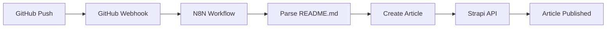
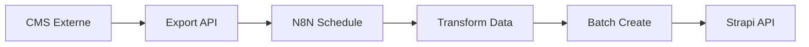
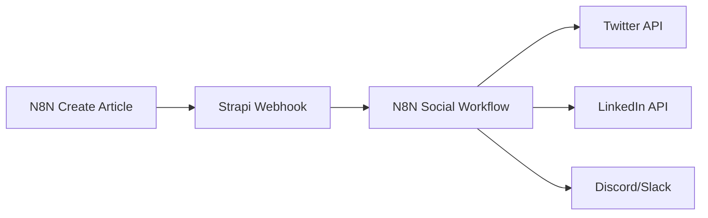

# Configuration N8N → Strapi - Guide Complet

## 🎯 Vue d'ensemble

Cette documentation explique comment configurer N8N pour pousser automatiquement du contenu vers Strapi via API.

## 🔧 Configuration Strapi

### 1. Générer un Token API pour N8N

Dans l'admin Strapi :

1. **Aller dans Settings → API Tokens**
2. **Créer un nouveau token** :
   - Name: `N8N Automation Token`
   - Description: `Token pour l'automation N8N`
   - Token duration: `Unlimited`
   - Token type: `Full access` ou `Custom`

3. **Si Custom, configurer les permissions** :
   ```json
   {
     "permissions": {
       "api::article.article": ["find", "findOne", "create", "update", "delete"],
       "api::project.project": ["find", "findOne", "create", "update", "delete"],
       "api::category.category": ["find", "findOne"],
       "api::tag.tag": ["find", "findOne"],
       "upload": ["upload", "destroy"]
     }
   }
   ```

4. **Copier le token généré** → à utiliser dans N8N

### 2. Variables d'Environnement

Ajouter dans `.env` :

```bash
# Token API pour N8N
STRAPI_N8N_API_TOKEN=your-generated-token-here

# Secret pour valider les webhooks
N8N_WEBHOOK_SECRET=your-super-secret-webhook-key

# URL Strapi (production)
STRAPI_URL=https://your-strapi-domain.com
```

## 🎣 Configuration N8N

### 1. Workflow N8N - Créer un Article

```json
{
  "name": "Create Article in Strapi",
  "nodes": [
    {
      "parameters": {
        "httpMethod": "POST",
        "path": "article-webhook",
        "responseMode": "responseNode"
      },
      "id": "webhook-trigger",
      "name": "Webhook Trigger",
      "type": "n8n-nodes-base.webhook",
      "position": [240, 300]
    },
    {
      "parameters": {
        "url": "={{$env.STRAPI_URL}}/api/articles",
        "authentication": "headerAuth",
        "headerAuth": {
          "name": "Authorization",
          "value": "Bearer {{$env.STRAPI_API_TOKEN}}"
        },
        "sendBody": true,
        "bodyContentType": "json",
        "jsonBody": "={{ \n  {\n    \"data\": {\n      \"title\": $json.title,\n      \"slug\": $json.slug || $json.title.toLowerCase().replace(/[^a-z0-9]+/g, '-'),\n      \"excerpt\": $json.excerpt,\n      \"body\": $json.body,\n      \"date\": $json.date || new Date().toISOString(),\n      \"publishedAt\": $json.publishNow ? new Date().toISOString() : null\n    }\n  }\n}}",
        "options": {
          "timeout": 30000
        }
      },
      "id": "create-article",
      "name": "Create Article",
      "type": "n8n-nodes-base.httpRequest",
      "position": [460, 300]
    },
    {
      "parameters": {
        "respondWith": "json",
        "responseBody": "={{ \n  {\n    \"success\": true,\n    \"message\": \"Article créé avec succès\",\n    \"data\": $json\n  }\n}}"
      },
      "id": "respond-success",
      "name": "Respond Success",
      "type": "n8n-nodes-base.respondToWebhook",
      "position": [680, 300]
    }
  ],
  "connections": {
    "Webhook Trigger": {
      "main": [
        [
          {
            "node": "Create Article",
            "type": "main",
            "index": 0
          }
        ]
      ]
    },
    "Create Article": {
      "main": [
        [
          {
            "node": "Respond Success",
            "type": "main",
            "index": 0
          }
        ]
      ]
    }
  }
}
```

### 2. Workflow N8N - Créer un Projet

```json
{
  "name": "Create Project in Strapi",
  "nodes": [
    {
      "parameters": {
        "httpMethod": "POST", 
        "path": "project-webhook",
        "responseMode": "responseNode"
      },
      "id": "webhook-trigger-project",
      "name": "Webhook Trigger Project",
      "type": "n8n-nodes-base.webhook",
      "position": [240, 300]
    },
    {
      "parameters": {
        "url": "={{$env.STRAPI_URL}}/api/projects",
        "authentication": "headerAuth",
        "headerAuth": {
          "name": "Authorization", 
          "value": "Bearer {{$env.STRAPI_API_TOKEN}}"
        },
        "sendBody": true,
        "bodyContentType": "json",
        "jsonBody": "={{ \n  {\n    \"data\": {\n      \"title\": $json.title,\n      \"slug\": $json.slug || $json.title.toLowerCase().replace(/[^a-z0-9]+/g, '-'),\n      \"description\": $json.description,\n      \"content\": $json.content,\n      \"status\": $json.status || 'active',\n      \"demoUrl\": $json.demoUrl,\n      \"githubUrl\": $json.githubUrl,\n      \"publishedAt\": $json.publishNow ? new Date().toISOString() : null\n    }\n  }\n}}"
      },
      "id": "create-project",
      "name": "Create Project", 
      "type": "n8n-nodes-base.httpRequest",
      "position": [460, 300]
    },
    {
      "parameters": {
        "respondWith": "json",
        "responseBody": "={{ \n  {\n    \"success\": true,\n    \"message\": \"Projet créé avec succès\",\n    \"data\": $json\n  }\n}}"
      },
      "id": "respond-success-project",
      "name": "Respond Success Project",
      "type": "n8n-nodes-base.respondToWebhook", 
      "position": [680, 300]
    }
  ]
}
```

### 3. Variables d'Environnement N8N

Dans N8N, configurer ces variables :

```bash
STRAPI_URL=https://your-strapi-domain.com
STRAPI_API_TOKEN=your-generated-token-from-strapi
WEBHOOK_SECRET=your-super-secret-webhook-key
```

## 📝 Exemples d'Usage

### 1. Créer un Article via N8N

**Endpoint N8N** : `POST https://your-n8n.com/webhook/article-webhook`

**Payload** :
```json
{
  "title": "Mon Nouvel Article",
  "slug": "mon-nouvel-article",
  "excerpt": "Ceci est un résumé de mon article...",
  "body": "# Mon Article\\n\\nContenu de l'article en markdown...",
  "date": "2025-09-29T10:00:00Z",
  "categorySlug": "javascript",
  "tagSlugs": ["react", "typescript"],
  "authorEmail": "author@blog.com",
  "featuredImageUrl": "https://example.com/image.jpg",
  "publishNow": true,
  "seo": {
    "metaTitle": "Mon Article - Blog",
    "metaDescription": "Description SEO de mon article",
    "keywords": ["javascript", "react"]
  }
}
```

### 2. Créer un Projet via N8N

**Endpoint N8N** : `POST https://your-n8n.com/webhook/project-webhook`

**Payload** :
```json
{
  "title": "Mon Nouveau Projet",
  "slug": "mon-nouveau-projet", 
  "description": "Description courte du projet",
  "content": "Description détaillée en markdown...",
  "status": "active",
  "categorySlug": "web-development",
  "technologySlugs": ["react", "nodejs", "mongodb"],
  "featuredImageUrl": "https://example.com/project.jpg",
  "galleryUrls": [
    "https://example.com/screen1.jpg",
    "https://example.com/screen2.jpg"
  ],
  "demoUrl": "https://demo.example.com",
  "githubUrl": "https://github.com/user/project",
  "publishNow": true
}
```

## 🔄 Workflows d'Automation

### 1. Publication Automatique depuis GitHub



**Configuration** :
1. GitHub webhook → N8N trigger
2. Parse du README.md pour extraire titre/contenu
3. Création automatique d'article
4. Notification Slack/Discord

### 2. Import depuis CMS Externe



### 3. Publication Réseaux Sociaux



## 🛠️ Scripts Utiles

### Script de Test N8N

```javascript
// test-n8n-integration.js
const axios = require('axios');

const N8N_WEBHOOK_URL = 'https://your-n8n.com/webhook/article-webhook';

const testArticle = {
  title: 'Test Article from N8N',
  excerpt: 'Ceci est un article de test créé via N8N',
  body: '# Test Article\\n\\nContenu de test pour vérifier l\\'intégration N8N → Strapi.',
  publishNow: true
};

async function testN8NIntegration() {
  try {
    const response = await axios.post(N8N_WEBHOOK_URL, testArticle);
    console.log('✅ Test réussi:', response.data);
  } catch (error) {
    console.error('❌ Test échoué:', error.response?.data || error.message);
  }
}

testN8NIntegration();
```

### Script de Monitoring

```javascript
// monitor-n8n-webhooks.js
const express = require('express');
const app = express();

app.use(express.json());

// Log de tous les webhooks reçus
app.post('/webhook/monitor', (req, res) => {
  console.log('🎣 Webhook reçu:', {
    timestamp: new Date().toISOString(),
    headers: req.headers,
    body: req.body
  });
  
  res.json({ received: true });
});

app.listen(3001, () => {
  console.log('📊 Monitoring webhook sur port 3001');
});
```

## 🔒 Sécurité

### 1. Validation des Webhooks

```javascript
// Validation signature webhook
const crypto = require('crypto');

function validateWebhookSignature(payload, signature, secret) {
  const computedSignature = crypto
    .createHmac('sha256', secret)
    .update(JSON.stringify(payload))
    .digest('hex');
    
  return crypto.timingSafeEqual(
    Buffer.from(signature),
    Buffer.from(computedSignature)
  );
}
```

### 2. Rate Limiting

```javascript
// Dans N8N, limiter les requêtes
const rateLimiter = {
  maxRequests: 100,
  timeWindow: 3600000, // 1 heure
  requests: new Map()
};
```

## 📊 Monitoring et Logs

### Logs Strapi
```javascript
// backend/config/middlewares.ts
export default [
  // Logger pour les API calls N8N
  {
    name: 'strapi::logger',
    config: {
      requests: true,
      level: 'debug'
    }
  }
];
```

### Dashboard N8N
- **Executions** : Voir les workflows exécutés
- **Logs** : Analyser les erreurs/succès  
- **Metrics** : Temps d'exécution, taux de succès

## 🚨 Dépannage

### Erreurs Communes

1. **401 Unauthorized** : Vérifier le token API
2. **404 Not Found** : Vérifier l'URL Strapi
3. **400 Bad Request** : Valider le format JSON
4. **500 Server Error** : Vérifier les logs Strapi

### Tests de Connectivité

```bash
# Test endpoint Strapi
curl -X GET "https://your-strapi.com/api/articles" \
  -H "Authorization: Bearer YOUR_TOKEN"

# Test webhook N8N  
curl -X POST "https://your-n8n.com/webhook/test" \
  -H "Content-Type: application/json" \
  -d '{"test": true}'
```

Vous êtes maintenant prêt à automatiser la création de contenu avec N8N ! 🚀